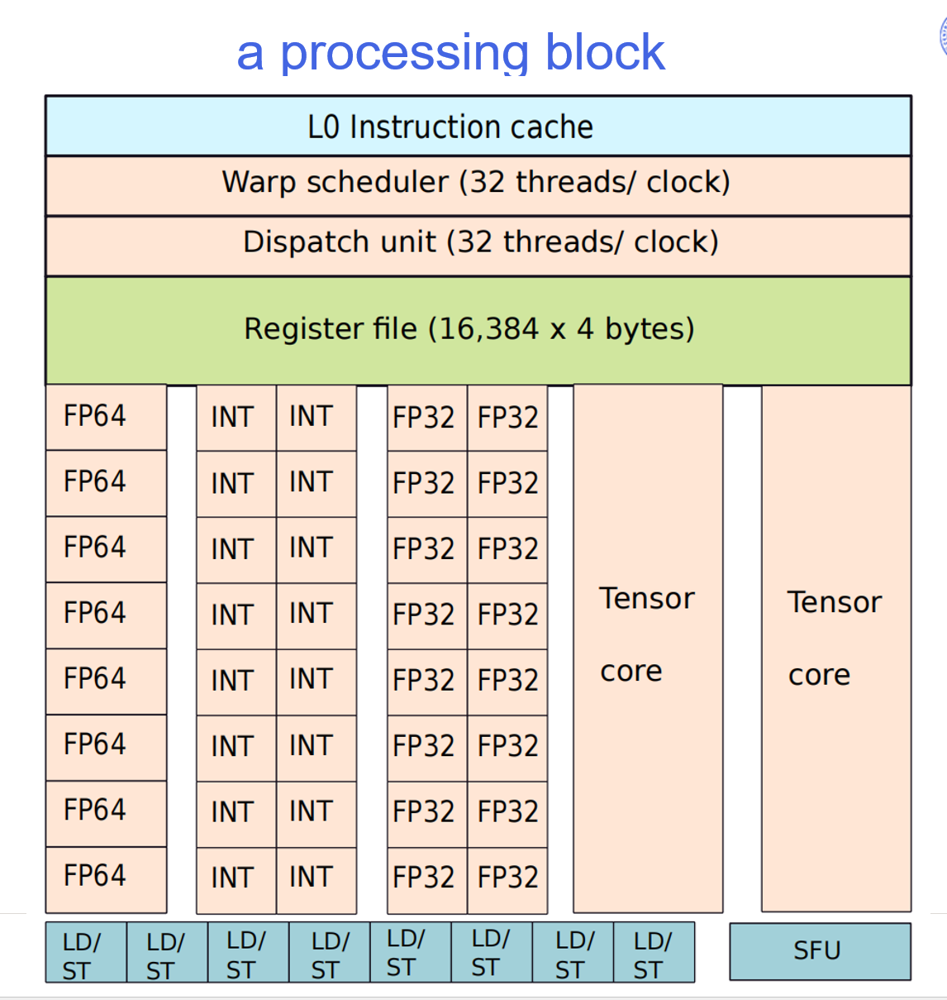
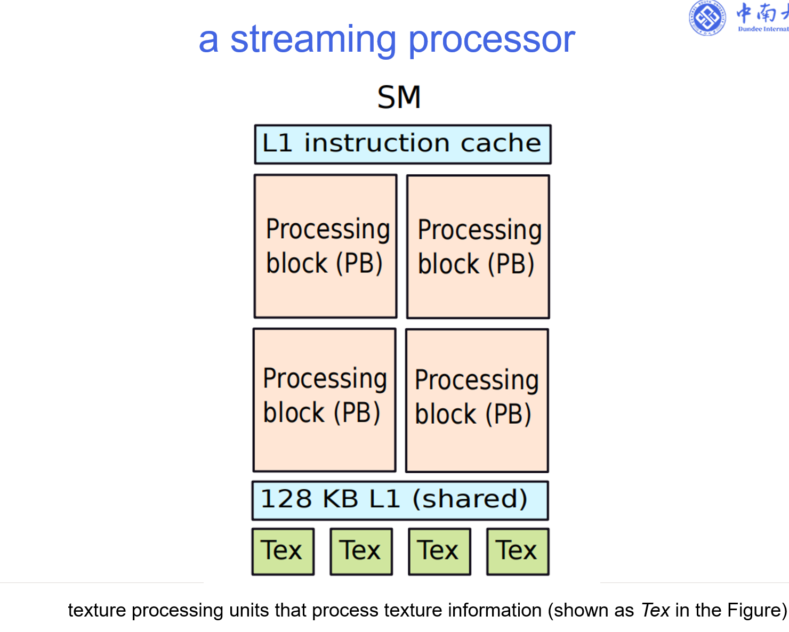
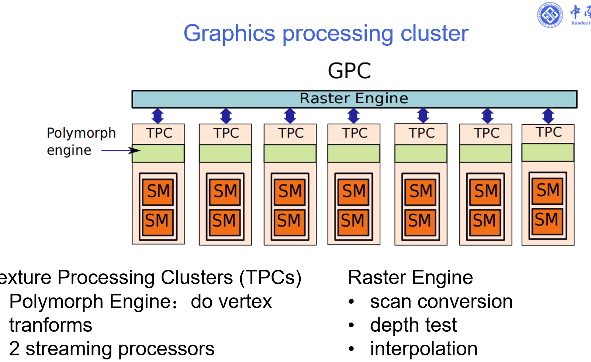
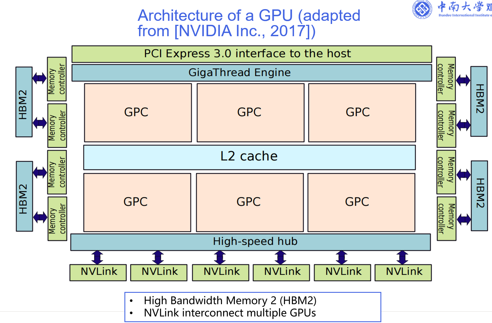

# GPU 笔记：GPGPU 与硬件架构

## 一、3D 图形基础

### 两大核心要素
- **Vertices（顶点）**：定义三角形和几何形状 → 决定“形状”
- **Textures（纹理）**：贴在三角形表面的像素信息 → 决定“外观”

## 二、基本图形操作

### 1. 顶点变换（Vertex Transforms）
将 3D 物体坐标转换为屏幕 2D 坐标，分为三步：
- **空间变换**：平移、旋转、缩放，放入世界坐标系
- **投影变换**：3D → 2D，实现近大远小（透视）或正射投影
- **视口变换**：2D 坐标映射到具体屏幕像素（如 1920×1080）

### 2. 纹理映射（Texture Mapping）
- 通过 UV 坐标将纹理贴到三角形表面
- 决定每个像素的最终颜色和细节

## 三、GPU 与矩阵运算

### 为什么 GPU 适合图形 / AI 计算？
- 图形渲染和 AI（如 LLM）都依赖大量矩阵运算
- 矩阵运算具有**高度并行性**：每个输出元素独立计算

### 矩阵乘法示例
C[i][j] = Σ_k A[i][k] × B[k][j]

### 并行性说明
- C[1][1] 和 C[1][2] 的计算互不依赖
- 可同时计算多个元素
- 理想情况下，n×n 矩阵可同时启动 n² 个计算

### GPU vs CPU
- GPU：大量小核心，适合并行计算
- CPU：少量大核心，适合复杂逻辑串行任务

> 实际限制：内存带宽、调度开销、负载不均

## 四、GPU 核心计算单元

| 单元 | 功能 |
|------|------|
| Tensor Core | 矩阵乘加（D = A×B + C），用于深度学习和图形变换 |
| FP Core | 浮点运算（小数加减乘除等） |
| INT Core | 整数运算、地址计算、控制流逻辑 |
| SFU | 特殊函数（sin/cos/exp/log/rsqrt/插值等），长延迟但高能效 |
| Ld/St Unit | 数据读写，地址生成 + 访存调度 + 数据加载/写回 |

## 五、GPU 硬件层级结构（自顶向下）




```text
GPU
 └── GPC（图形处理簇）
      └── TPC（纹理处理簇）
           ├── Polymorph Engine（顶点变换）
           ├── SM（流式多处理器） ×2
           │    └── SP / Core
           │         ├── Tensor Core
           │         ├── FP Core
           │         ├── INT Core
           │         ├── SFU
           │         └── Ld/St Unit
           └── Texture Unit（纹理单元）
```

## 六、图形渲染管线简化的数据流

```text
顶点数据
   ↓
Polymorph Engine（顶点变换）
   ↓
Raster Engine（光栅化：三角形 → 像素）
   ↓
Texture Unit（纹理采样）
   ↓
SFU / FP Core（像素着色、光照计算）
   ↓
显存输出（最终画面）
```

## 七、总结一句话

> GPU 的本质：用大量专用小核心，把可并行的大计算拆碎、同时干、更快干完。

## 八、wrap
“GPU 把 32 个线程绑成一队，叫 Warp。这一队人步调完全一致，同时做同一件事,使得调度更简单”
+ SIMT model：single instruction， multiple threads。
threads的定义：
+ 有自己的workplace（private register and local memory）
+ 有自己的特有的ID


## 九、SIMT
### 1. 核心定义：
单指令，多线程，同时处理同一个指令代码。每个指令有自己的数据和寄存器。
SIMT = SIMD + 多线程调度 + 标量化编程模型
这是最核心的一句。它解释了SIMT不是什么全新的东西，而是三层技术的叠加：
-   **底层硬件**：依然是**SIMD**（单指令多数据流），即一个指令控制32个ALU同时干活。
-   **中层调度**：加入了**硬件级的多线程汇编调度器**。这个调度器负责动态切换Warp，让你感觉有很多“核”在同时跑。
-   **上层编程**：提供了**标量化编程模型**。程序员不用像写CPU的SIMD（如AVX指令）那样手动打包数据，而是像写普通的标量代码（一个线程处理一个数）一样简单。

### 2. 分支问题 (The Branching Problem)
-   有些线程条件为真，有些为假，但 Warp 必须同时执行同一指令。
-   **轻松是指“程序员写代码”轻松**：你可以随便写`if/else`，硬件会帮你处理。
-   **硬件并不轻松**：当Warp内出现分支时（32个线程有的走A路，有的走B路），硬件会**串行执行**两条路。虽然能正确跑，但性能会下降。这就是Warp发散。
-   怎么解决？GPU 会让所有线程先走 if 路径，再走 else 路径，但每次只让符合条件的线程真正执行，其他线程“假装执行但不改结果”。
就像全班一起做两道题，但第一题只让男生交卷，第二题只让女生交卷。

### 3. 隐藏内存延迟 (Hiding Memory Latency)
这是Warp存在的**最重要工程原因**。
-   **现象**：GPU访问显存很慢（几百个时钟周期）。
-   **解法**：Warp A去读内存（等待数据返回）-> 立刻切换到Warp B执行计算 -> Warp A数据回来后再切回来。
-   **结论**：GPU不需要大容量的CPU缓存，它靠**“换人”**（大量Warp轮换）来藏住延迟。

### 4. 可编程性 (Programmability)
这是**历史进步的最大体现**。
-   **以前（SIMD）**：你要手动管理数据对齐（比如16个float一组），写循环展开，代码很丑陋。
-   **现在（SIMT）**：你写`c[i] = a[i] + b[i]`，编译器+硬件自动帮你完成向量化。

### 5. 死锁
“锁步执行导致：我想等你先做完，但你也必须跟我一起走下一步，结果谁也动不了。”

### 总结这张图的内在逻辑
1.  **程序员**看到的是**标量代码**（简单）。
2.  **编译器+调度器**把它包装成**线程**。
3.  **硬件**把这些线程捆绑成**Warp**。
4.  **Warp**驱动底层的**SIMD单元**（高效）。
5.  当**延迟（内存等待）** 发生时，调度器瞬间切到**另一个Warp**。
