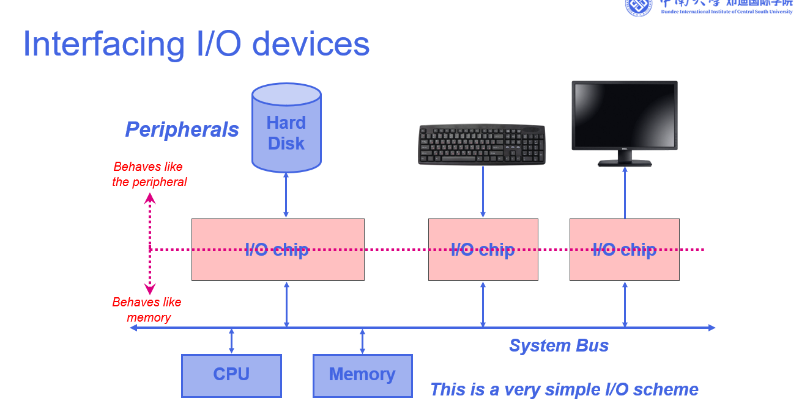

## 0. 快速总览

- I/O 设备由两部分组成：I/O 接口（控制器）+ 外设本体。
- 外设不能直接无差别接系统总线，需要接口做协议、速度和错误处理适配。
- 常见 I/O 控制方式：轮询、中断、DMA、通道控制。
- 缓冲（单缓冲/双缓冲）的核心是尽量让 I/O 与计算重叠。

## 1. 基本概念

- I/O 设备 != 外设
- I/O 设备 = I/O 接口（芯片/控制器）+ 外设（机械/物理部分）

## 2. 为什么外设不能直接连系统总线

### 2.1 先回答“为什么要连”

CPU 只能直接处理内存中的数据。因此，外存（硬盘/SSD/网络）中的数据必须先进入主存，CPU 才能处理。

同一份数据在外存和在主存中，对 CPU 来说处理方式不同：

- 在外存：先搬运到主存
- 在主存：CPU 可直接访问

### 2.2 为什么必须经过 I/O 接口

如果各种外设都直接挂在系统总线上，会带来以下问题：

- 协议不统一：外设类型差异很大，直接接入会破坏总线一致性
- 地址空间差异：系统总线主要对应内存地址空间，外设常用 I/O 地址空间（或 MMIO）
- 错误处理复杂：外设可能出现机械故障、CRC 错误等，需要控制器先处理，不能全部直接丢给 CPU
- 速度差异大：外设通常比 CPU/内存慢很多，需要缓冲与节流机制

### 2.3 I/O 接口的作用

I/O 接口（芯片/控制器）负责在 CPU/内存 与 外设之间做协议与数据转换：

- 对 CPU/内存一侧：表现为可读写的设备寄存器
- 对外设一侧：按设备特性进行控制与状态管理



## 3. 为什么需要 I/O 控制方式

外部设备（键盘、打印机、硬盘等）相对 CPU 速度很慢。不能让 CPU 一直空等设备，必须采用更高效的控制方式。

常见四种 I/O 控制方式：

1. 轮询（程序查询）
2. 中断驱动
3. DMA（直接内存访问）
4. 通道控制

对比记忆：

| 方式 | 数据搬运主力 | CPU 参与度 | 典型特点 |
| --- | --- | --- | --- |
| 轮询 | CPU | 高 | 实现简单，但等待浪费严重 |
| 中断 | CPU | 中 | 设备就绪后通知 CPU，减少空转 |
| DMA | DMA 控制器 | 低 | 大块传输高效，CPU 只做配置与收尾 |
| 通道 | 通道处理机 | 更低 | 适合更复杂 I/O 组织 |

## 4. 轮询示例：打印机输出 “WORD”

### 4.1 数据起点

要打印的字符串 `WORD` 最初位于主存。

### 4.2 完整流程

1. CPU 从主存读取字符（如 `W`）到 CPU 寄存器。
2. CPU 轮询打印机状态。
3. 打印机就绪后，CPU 将字符写入打印机 I/O 芯片。
4. 打印机执行打印。
5. CPU 继续轮询，待打印机再次就绪后处理下一个字符。

### 4.3 谁读谁的数据（含主存）

| 动作 | 谁读 | 从哪读 | 写到哪 |
| --- | --- | --- | --- |
| 读数据 | CPU | 主存 | CPU 寄存器 |
| 写数据 | CPU | CPU 寄存器 | 打印机 I/O 芯片 |
| 读状态（轮询） | CPU | 打印机 I/O 芯片 | - |

### 4.4 一句话总结

CPU 先读主存，再写打印机，中间持续轮询等待设备就绪。

### 4.5 优缺点

- 优点：实现简单，不需要额外复杂硬件。
- 缺点：CPU 时间浪费严重，大量时间用于等待。

## 5. 中断示例：键盘输入 “H”

### 5.1 数据终点

键盘输入字符 `H` 最终写入主存中的键盘缓冲区，供程序读取。

### 5.2 完整流程

1. 用户按下 `H`，键盘 I/O 芯片接收字符。
2. 键盘 I/O 芯片向 CPU 发出中断请求。
3. CPU 暂停当前程序并保存现场。
4. CPU 执行中断服务程序：
	- 从键盘 I/O 芯片读出 `H` 到 CPU 寄存器。
	- 将 `H` 写入主存键盘缓冲区。
5. CPU 恢复现场，继续执行原程序。

### 5.3 谁读谁的数据（含主存）

| 动作 | 谁读 | 从哪读 | 写到哪 |
| --- | --- | --- | --- |
| 读数据（中断处理） | CPU | 键盘 I/O 芯片 | CPU 寄存器 |
| 写数据（中断处理） | CPU | CPU 寄存器 | 主存 |

### 5.4 一句话总结

键盘 I/O 芯片主动发中断，CPU 在中断处理时完成“读设备、写主存”。

### 5.5 优缺点

- 优点：CPU 利用率高，可并行处理更多任务。
- 缺点：依赖中断硬件支持，存在保存/恢复现场开销，调试复杂度较高。

补充：

- 在中断驱动中，CPU 仍是 memory 与 I/O 设备之间的数据搬运桥梁。
- 若传输频繁且数据量大，CPU 仍会花较多时间在搬运上，这就是 DMA 的动机。

## 6. DMA 核心要点

- DMA 本质：由 DMA 控制器代替 CPU 执行主存与 I/O 之间的数据搬运。
- CPU 主要负责：初始化 DMA 参数、启动传输、处理完成中断。告诉DMA信息,whether a write or a read is required、the starting location in memory to write to or to read from、the amount of data to be written or read、the address of the I/O device involved

关于总线优先级的常见理解：

- 实际策略取决于系统设计（固定优先级、轮转、时间片等）。
- cycle stealing: 在高吞吐 I/O 场景中，常给 DMA 较高优先级以避免设备缓存溢出或传输中断。

为什么常按一个 word（字长）传输：

- 可与总线数据宽度对齐，提升单次传输有效负载。
- 降低非对齐访问带来的额外开销。

---

## 7. 缓冲与性能分析

### 7.1 问题设定

假设有一个程序需要：
- 从磁盘读取 **若干个块（block）** 的数据
- 每读完一个块，就要对它进行一些**计算**

已知：
- 每个块读取的时间 = **T**（I/O 时间）
- 每个块计算的时间 = **C**（CPU 时间）
- 一共有 **N 个块**

---

## (a) 无缓冲（no buffering）

**含义**：  
读一个块 → 等它读完 → 计算这个块 → 再读下一个块 → 等它读完 → 计算下一个块 …  
**I/O 和计算完全不重叠**。

**总时间**：
\[
N \times (T + C)
\]

---

## (b) 有 I/O 缓冲

这里引入了**缓冲区**（在内存中）。  
- 从磁盘读到缓冲区（耗时 T）  
- 从缓冲区**复制到进程数据区**（耗时 M）  
- 计算（耗时 C）  

题目假设：
- \( T = 2C \)（读取时间是计算时间的 2 倍）
- \( M \ll C \)（复制时间远小于计算时间）
- 进程一旦 I/O 完成（从阻塞变就绪），可以立即继续运行

---

### (i) 单缓冲（single buffer）

**过程**：
1. 读块1到缓冲区（T）
2. 把块1从缓冲区复制到进程（M）
3. 开始计算块1（C）
4. 在计算的同时，**不能读下一个块**（因为缓冲区被占用）
5. 等计算完才能再读下一个块

**时间图（示意）**：

```
读块1   : [---T---]
复制块1 :        [M]
计算块1 :          [---C---]
读块2   :                  [---T---]
复制块2 :                         [M]
计算块2 :                           [---C---]
...
```

你会发现：  
- 总时间 ≈ \( T + N \times \max(T, C) + M \)（但 M 很小可忽略）  
- 因为 \( T > C \)，瓶颈是 T，近似按 \( N \times T \) 增长

---

### (ii) 双缓冲（double buffering）

**两个缓冲区**（buffer 0 和 buffer 1）：
- 可以**在一个块计算的同时，读下一个块到另一个缓冲区**
- 但是不能同时读两个块因为读取需要IO设备的参与，只有一个设备。
- C 是计算阶段，M 是从缓冲区复制到进程地址空间。
- M 与 C 能否重叠取决于内存地址冲突和同步机制：
	- 若访问同一地址范围（或同锁区），通常不能重叠。
	- 若地址与锁范围互不冲突，则可部分重叠。

**过程**：
1. 读块1到 buffer0（T）
2. 复制块1到进程（M）+ 开始计算块1（C）
3. 在计算块1的**同时**，读块2到 buffer1（T）
4. 块1计算完 → 复制块2 → 计算块2 → 同时读块3到 buffer0 …

**时间图**：

```
buffer0读块1: [---T---]
复制块1      :        [M]
计算块1      :          [---C---]
buffer1读块2:            [---T---]
复制块2      :                    [M]
计算块2      :                      [---C---]
buffer0读块3:                        [---T---]
...
```

**优势**：  
I/O 和计算**完全重叠**（除了第一个块的初始读取和最后一个块的收尾），总时间 ≈ **T + N × max(T, C)**。  
当 \( T \) 和 \( C \) 接近时，比单缓冲快得多。

---

### 双缓冲的其它优点（题目最后问）

1. **应对 I/O 和计算时间不匹配**：比如 I/O 时间变化大时，双缓冲可以避免 CPU 等待。
2. **流式处理（streaming）**：在音视频播放、数据采集等实时系统中，双缓冲防止卡顿。
3. **减少“颠簸”**：在某些存储系统中，持续 I/O 能提高带宽利用率。

---
### Reality Check

**1. 磁盘能不能同时读写？**
- **看起来能**：比如你在下载（写）的同时看电影（读），感觉是同时的。
- **实际上不能（机械硬盘）**：机械硬盘的物理磁头同一时刻只能在一个位置，要么读，要么写。所谓的“同时”只是它在读、写、读、写之间疯狂**快速切换**。
- **后果**：这种频繁的“跳来跳去”会浪费大量时间（磁头寻道），所以**整体速度反而变慢了**。
- **结论**：因此，在计算缓冲（Buffer）时，我们**假设读写不能重叠**，必须排队一个一个来。

**2. 为什么实际情况更复杂？**
- 上面的例子都是**理想情况**（假设只跑一个程序）。
- 实际上，电脑后台有几十个进程在抢着用磁盘。操作系统还得给它们排队、插队，所以**完成时间不确定**，可能快可能慢。
- **流程是这样的**：
    - **读**：磁盘 -> Buffer（内存） -> CPU/程序
    - **写**：CPU/程序 -> Buffer（内存） -> 磁盘
- **重点**：Buffer是数据的中转站。无论读写，数据都得先经过Buffer。磁盘本身不存Buffer，它只负责把数据**吐给**Buffer（读）或者从Buffer**拿走**（写）。

一句话总结：**机械硬盘不能同时读写，只能来回切换；Buffer是内存里的中转站，读写都靠它。**

## 8. 结论速记

- 小数据、低复杂度设备：轮询可用，但 CPU 利用率低。
- 事件触发型设备：中断更合理。
- 大块高频传输：优先考虑 DMA。
- 追求吞吐与平滑处理：双缓冲通常优于单缓冲。

