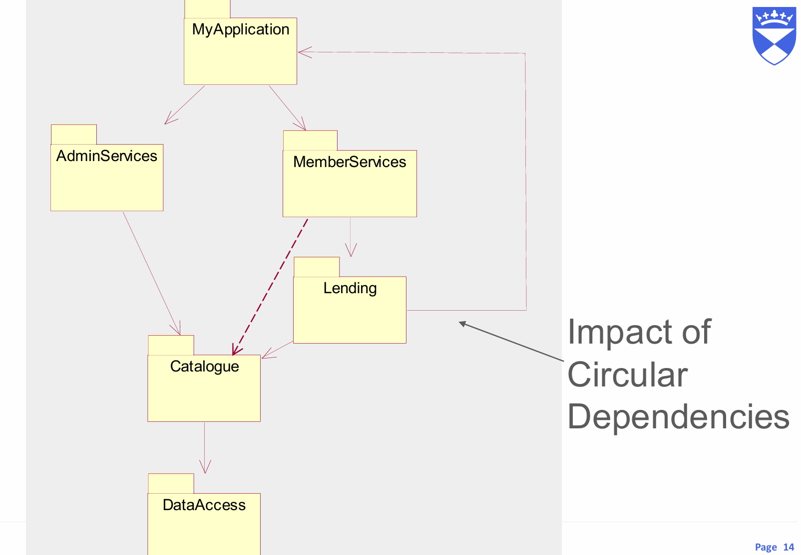
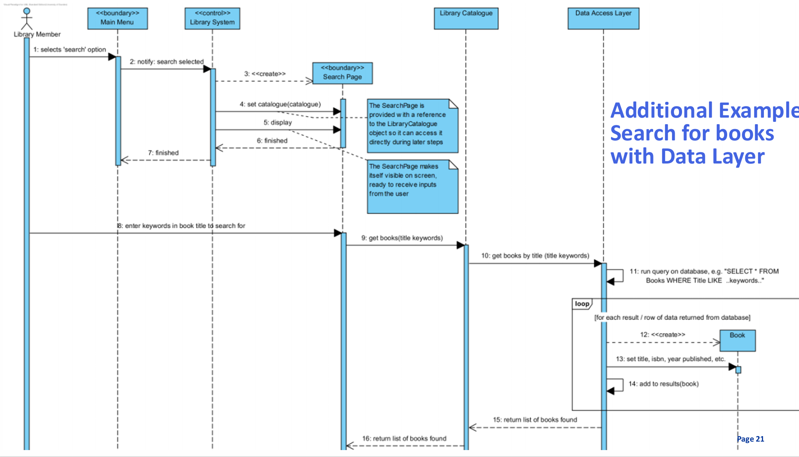

---

## 一、SOLID设计原则

### 20% 核心内容（你最需要掌握的）

| 原则 | 一句话解释 | 关键英语 |
|------|-----------|----------|
| **SRP** | 一个类只做一件事 | Single Responsibility |
| **OCP** | 对扩展开放，对修改关闭 | Open-Closed |
| **LSP** | 子类可以替换父类 | Liskov Substitution |
| **ISP** | 接口要小而专一 | Interface Segregation |
| **DIP** | 依赖抽象，不依赖具体 | Dependency Inversion |

### 举例说明，牢记课件上的反例即可。

**SRP 反例（坏设计）**  
一个 `ProductReport` 类既生成报表，又保存文件。  
**改好后**：拆成 `ReportGenerator` + `ReportSaver`。

**OCP 反例**  
`DrawShape` 函数里用 `if (shape.type == "Circle")` 判断。  
**改好后**：每个形状自己实现 `draw()` 方法。

**LSP 经典陷阱**  
让 `Square` 继承 `Rectangle`。  
问题：`setWidth()` 和 `setHeight()` 在 `Square` 中会互相影响，破坏父类行为预期。

**ISP 例子**  
一个 `PaymentMethod` 接口强制实现 `processPayPal()`，但 `CreditCard` 用不到。  
**改好后**：拆成 `CreditCardPayment` 和 `PayPalPayment` 两个独立接口。

**DIP 例子**  
`PowerSwitch` 直接依赖 `LightBulb`。  
**改好后**：依赖 `Switchable` 抽象，`Fan` 和 `LightBulb` 都实现它。

---

## 二、包与层组织（Packages & Layers）

### 20% 核心内容

| 概念 | 说明 | 英语 |
|------|------|------|
| **Package** | 把相关类分组 | Package |
| **Layer** | 水平分层（表现 / 业务 / 数据） | Layer / Tier |
| **依赖无环** | 包之间不能循环依赖 | Acyclic Dependency |
| **按层打包 vs 按功能打包** | 技术分层 vs 业务功能内聚 | Package by Layer / Feature |

### 举例说明

**三层架构**  
- 表现层：`SearchPage`（用户输入）  
- 业务层：`LibraryCatalogue`（搜索逻辑）  
- 数据层：`BookRepository`（数据库操作）

**循环依赖问题**  

`Lending` 依赖 `MyApplication`。  
`MyApplication` 又依赖 `MemberServices`，`MemberServices` 依赖 `Lending`。  

其实不能表明 `MyApplication` 依赖 `Lending`，因为依赖不可传递。课件的图画得不好。  

但是——在实际代码和设计中，如果 `MyApplication` 调用了 `MemberServices` 的一个方法，而该方法内部又调用了 `Lending`，那么从运行或修改的影响角度，`MyApplication` 确实间接依赖 `Lending`。那我们干脆假设 `MyApplication` 依赖 `Lending` 吧。

**解决方法**：  
创建一个新包，把 `Lending` 和 `MyApplication` 都依赖的类放到这个新包里。  

这样，原来的两个包只依赖这个新包，而不再互相依赖，打破了循环依赖。

**总之 package 的好处**：

- 好管理
- 好分工
- 避免乱七八糟的依赖（circular dependency）

**两个重要的设计原则**
高内聚（High Cohesion）
一个包里的类应该“关系紧密”

比如 Loan 和 Book 放一起就很好

低耦合（Low Coupling）
不同包之间尽量少依赖

避免“改一个类，改一堆包”

**按功能打包VS按层打包**  
Package by Layer（按层打包）
→ 容易出现 高耦合、低内聚（因为一个功能要跨多个包）

Package by Feature（按功能打包）
→ 更推荐，因为一个功能的所有类都在一个包里，高内聚、低耦合

---

## 三、时序图（Sequence Diagram）
### 为什么要用序列图？
我们已经有了用例（Use Case）：描述系统要做什么

我们也有了类图（Class Diagram）：描述系统有什么类

但这些类怎么合作来完成用例？——用序列图
### 20% 核心内容

| 元素 | 说明 | 英语 |
|------|------|------|
| **生命线** | 一个对象的时间线，竖着的虚线，从上往下表示时间顺序 | Lifeline |
| **消息** | 对象之间的调用，有箭头的实线 | Message |
| **激活条** | 对象正在执行，矩形条 | Activation Bar |
| **创建/销毁** |箭头指向被创建对象的生命线顶端，消息文字写 `<<create>>`| Creation / Destruction |
| **返回** | 虚线箭头 | Return |

### 举例说明
**用例1**

**用例2：搜索图书**

1. 用户输入关键词  
2. UI 调用 `LibraryCatalogue.getBooks(keywords)`  
3. `LibraryCatalogue` 遍历 `Book` 对象，调用 `titleMatches(keywords)`  
4. 匹配的 `Book` 被加入结果列表  
5. 结果返回给 UI 显示

**对应消息**  
`selects 'search'` → `notify: search selected` → `<<create>> SearchPage` → `get books(title keywords)` → `return list of books found`

> 帕累托视角：**生命线 + 消息 + 激活条** 能画出80%的常见时序图。

---

## 总结：80/20 速查表

| 课件 | 20%重点 | 80%应用场景 |
|------|---------|-------------|
| SOLID | SRP, OCP, DIP | 重构类设计、避免僵硬代码 |
| 包与层 | 分层 + 无环依赖 | 大型系统组织、团队分工 |
| 时序图 | 生命线、消息、激活条 | 用例实现、对象协作分析 |

---

