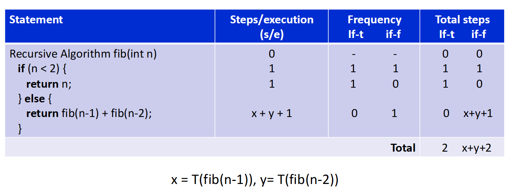

结合你上传的关于**空间复杂度（Space Complexity）**、**递归（Recursion）**、**斐波那契数列（Fibonacci）**和**欧几里得算法（Euclid GCD）**的两份课件，我为你设计了一套模拟面试题。

这套题分为三个阶段：**基础概念**、**深度剖析**、**算法实战**。请先尝试在心里回答，然后再看解析。

---

### 🚀 第一部分：模拟面试实战

#### 1. 基础概念题 (The Warm-up)
**面试官：** “请解释一下什么是空间复杂度？如果一个算法的时间复杂度是 $O(n^2)$，它的空间复杂度一定也是 $O(n^2)$ 吗？为什么？”

*   **考察点：** 空间复杂度的定义，与时间复杂度的区分。
*   **参考答案方向：** 空间复杂度是算法运行所需内存的量（不包括输入本身）。两者没有必然联系。例如冒泡排序时间是 $O(n^2)$，但只需要几个临时变量，空间是 $O(1)$。

#### 2. 递归与栈 (The Core)
**面试官：** “递归算法的空间复杂度通常是多少？为什么？请结合递归栈（Recursive Stack）来解释。”

*   **考察点：** 递归栈的机制，递归深度与空间的关系。
*   **参考答案方向：** 递归的空间复杂度通常取决于**递归树的高度（Height）**，而不是节点总数。因为递归是深度优先的，系统栈会保存每一层的局部变量和返回地址，直到递归结束才释放。例如计算阶乘 $n!$，递归深度是 $n$，所以空间复杂度是 $O(n)$，而迭代版本只需要 $O(1)$。

#### 3. 经典算法对比 (The Deep Dive)
**面试官：** “斐波那契数列（Fibonacci）的递归实现和迭代实现，它们的空间复杂度分别是多少？为什么递归版本的空间复杂度不是 $O(2^n)$（虽然它的时间复杂度是指数级的）？”

*   **考察点：** 斐波那契递归树的结构，栈空间的复用机制。
*   **参考答案方向：**
    *   **迭代：** $O(1)$。只需要常数个变量（如 `u`, `v`, `t`）。
    *   **递归：** $O(n)$。
    *   **关键解释：** 虽然递归调用的总次数（时间）接近 $2^n$，但**空间**是按路径使用的。系统栈不会同时保存所有 $2^n$ 个节点。它先一路深入到叶子节点（深度约 $n$），然后回溯。在回溯过程中，上层的栈帧被弹出，内存被释放。因此，栈中同时存在的最大帧数等于树的高度 $n$，而不是节点总数。

#### 4. 进阶难题 (The Challenge)
**面试官：** “欧几里得算法（GCD）的最坏空间复杂度是多少？它和斐波那契数列有什么关系？”

*   **考察点：** 欧几里得算法的递归深度，拉梅定理（Lamé's Theorem）。
*   **参考答案方向：**
    *   最坏空间复杂度是 $O(\log b)$。
    *   **关系：** 欧几里得算法的最坏情况发生在输入是两个**连续的斐波那契数**时（如 `Fib(k+1)` 和 `Fib(k)`）。在这种情况下，递归的深度最大。根据拉梅定理，这个深度大约是较小数的位数的常数倍，即对数级 $O(\log b)$。

---

### 📝 第二部分：空间复杂度总结笔记 (Cheat Sheet)

这份笔记浓缩了你上传文档的核心考点，建议直接背诵或截图复习。

#### 1. 空间复杂度基础 (Space Complexity Basics)

| 概念 | 定义 | 关键点 |
| :--- | :--- | :--- |
| **定义** | 算法运行所需的**额外**内存空间（不包括输入数据本身）。 | 关注的是“变量”和“栈”，不是“代码”或“输入”。 |
| **组成** | $S(P) = C + S_P$ | $C$ 是常数（代码、静态变量），$S_P$ 是变量空间（动态分配、递归栈、数组）。 |
| **Big-O** | 忽略常数和低阶项。 | $3n+2 \to O(n)$; $5 \to O(1)$。 |

#### 2. 迭代 vs 递归 (Iteration vs Recursion)

*   **迭代 (Iteration):**
    *   通常空间复杂度较低。
    *   例子：数组初始化、阶乘计算。
    *   **空间复杂度：** 通常为 $O(1)$（常数空间），除非你创建了新的大数组（如 $O(n)$ 或 $O(n^2)$）。

*   **递归 (Recursion):**
    *   隐式使用了系统调用栈（Call Stack），栈的大小=计算步骤数。
    *   **核心公式：** 递归的空间复杂度 $\approx$ **递归树的高度 (Height of Recursion Tree)**。
    *   **注意：** 不要被时间复杂度误导！指数级时间（$O(2^n)$）不代表指数级空间，空间通常是线性的（$O(n)$）。递归栈的大小是递归树高度，每次调用递归函数，方式是LIFO，计算机就要在内存里记录当前函数的状态，等递归返回后再释放。这个“同时存着的函数调用层数”就是栈深度，也就是算法的空间复杂度

#### 3. 核心算法空间复杂度速查表

| 算法 | 实现方式 | 空间复杂度 ($S(n)$) | 原因解析 |
| :--- | :--- | :--- | :--- |
| **Fibonacci** | Iterative | **$O(1)$** | 仅需 3 个变量 (u, v, t) 循环更新。 |
| **Fibonacci** | Recursive | **$O(n)$** | 递归树高度为 $n$。虽然时间是 $O(2^n)$，但栈空间是深度优先，最大深度为 $n$。 |
| **Factorial** | Iterative | **$O(1)$** | 仅需 1 个累乘变量。 |
| **Factorial** | Recursive | **$O(n)$** | 需要 $n$ 层栈帧才能从 $n$ 回溯到 1。 |
| **GCD (Euclid)** | Recursive | **$O(\log n)$** | **最坏情况**：输入为连续的斐波那契数，递归深度为对数级。<br>**最好情况**：当 $b$ 能被 $a$ 整除时，为 $O(1)$。 |
| **Binary Search** | Recursive | **$O(\log n)$** | 每次将问题规模减半，树高为 $\log_2 n$。 |

#### 4. 面试必杀技：递归栈的深度 (Recursive Stack Depth)

*   **乘法规则 (Exponential Growth):**
    *   如果一个问题每次分裂成 $b$ 个子问题（如二叉树 $b=2$），且深度为 $d$，**时间**复杂度通常是 $O(b^d)$。
    *   **例子：** 斐波那契递归（指数时间）。

*   **除法规则 (Logarithmic Reduction):**
    *   如果一个问题每次规模减半（Divide by 2），**空间**复杂度通常是 $O(\log n)$。
    *   **例子：** 二分查找、欧几里得算法（对数空间）。

*   **通用法则：**
    *   **栈空间 = 递归深度。**
    *   **时间 = 递归树的总节点数。**

#### 5. 文档中的经典陷阱 (Common Pitfalls)

1.  **混淆时间与空间：** 不要看到斐波那契递归有 $2^n$ 个节点就说是 $O(2^n)$ 空间。栈是“用完即焚”的，只有路径长度算空间。
2.  **忽略常数：** 即使算法用了 100 个变量，只要不随输入 $n$ 增长，空间就是 $O(1)$。
3. 如果遇到空间复杂度问题，**先画图**（递归树），然后数一数从根到叶子的最长路径（深度）。这是最稳妥的解题思路。当然也可以直接通过代码判断用了多少空间。

### 📝 第三部分：时间复杂度总结笔记 (Cheat Sheet)
时间复杂度=compilation time + execution(run) time，通常省略compilation time。
关心CPU的占用时间。
经典案例：
```for (int i = n; i <= m; i++)```
检查条件的frequency是m-n+2，因为最后退出的时候i==m+1，包含了最后退出的检查，frequency = m+1-n+1。而循环体进行了m-n+1次。
```
i = a;
while(i<n){
    ...
    i--;
}
```
frequency = a-(n-1)+1 = a-n+2，循环体执行了a-n+1次。

---

#### 🧠 第1步：回顾递归的直观分析方法

我们从最简单的递归例子开始：

```python
def factorial(n):
    if n == 1:
        return 1
    else:
        return n * factorial(n-1)
```

 ❓问题：

- 每次递归调用做了多少工作？
- 总共有多少次递归调用？

 ✅结论：

- 每次调用是常数时间（O(1)）
- 一共调用 n 次
- 时间复杂度 = **O(n)**

---

#### 🧮 第2步：引入递推关系

递归算法的复杂度可以用**递推式recurrence relation**表示。
T(n)表示解决一个规模为 n 的问题所需要的时间。O是T这个函数在 n 无限大时的“渐近紧上界”。

例如，对于 `RSum`（递归求和）：

```python
def RSum(arr, n):
    if n <= 0:
        return 0
    else:
        return RSum(arr, n-1) + arr[n]
```

### 分析步骤：

- 每次调用执行常数时间（比较、加减、返回）
- 但还有一次递归调用 `RSum(arr, n-1)`

我们可以写出递推式：

```
T(n) = T(n-1) + O(1)
```

### 如何解？
反复展开：

```
T(n) = T(n-1) + 2
     = T(n-2) + 2 + 2
     = T(n-3) + 2*3
     = ...
     = T(0) + 2*n
     = 2 + 2n
```
✅ 时间复杂度：**O(n)**

课件的例子(其实不必纠结，可以直接写表达式)：

## 表格结构含义
Statement：算法中的每一行（或逻辑步骤）。

Steps/execution (s/e)：执行这一行 一次 所需要的“单位时间步数”（通常简化计数，比如比较、赋值、返回各算 1 步）。

Frequency：执行没有，0或1

Total steps = s/e × Frequency。

---

#### 🧩 第3步：常见的递推关系与复杂度

| 递推关系 | 示例算法 | 时间复杂度 |
|----------|-----------|-------------|
| T(n) = T(n-1) + O(1) | 递归求和、阶乘 | O(n) |
| T(n) = T(n/2) + O(1) | 二分查找、GCD（欧几里得算法） | O(log n) |
| T(n) = 2T(n/2) + O(1) | 遍历满二叉树 | O(n) |
| T(n) = 2T(n-1) + O(1) | 斐波那契（递归写法）、二叉树构造 | O(2ⁿ) |
| T(n) = 2T(n/2) + O(n) | 归并排序 | O(n log n) |
| T(n) = T(n-1) + O(n) | 某些排序算法（如选择排序） | O(n²) |

---

#### 🔁 第4步：斐波那契的递归复杂度

```python
def fib(n):
    if n <= 1:
        return n
    else:
        return fib(n-1) + fib(n-2)
```

### 分析：

- 每次调用有两个递归调用
- 递归树深度 = n
- 节点数 ≈ 2ⁿ

### 递推式：
```
T(n) = T(n-1) + T(n-2) + O(1)
```

这近似于：
```
T(n) ≈ 2 * T(n-1)
```

✅ 时间复杂度：**O(2ⁿ)**（指数级，极慢）
✅ 空间复杂度：**O(n)**（因为画个树发现深度为n）

---

#### 🧠 第5步：尾递归优化

尾递归可以避免多路递归调用，提升效率。

```python
def fib_tail(n, a=0, b=1):
    if n == 0:
        return a
    else:
        return fib_tail(n-1, b, a+b)
```

- 每次只调用一次自身
- 递推式：T(n) = T(n-1) + O(1)
- 尾递归版本是自底向上累积结果
- ✅ 时间复杂度：**O(n)**

```
fib_tail(5, 0, 1)
= fib_tail(4, 1, 0+1=1)
= fib_tail(3, 1, 1+1=2)
= fib_tail(2, 2, 1+2=3)
= fib_tail(1, 3, 2+3=5)
= fib_tail(0, 5, 3+5=8)  # n=0，返回 a=5
→ 结果是 5
```
参数含义：

n：还剩多少步

a：当前数（初始是 Fib(0)=0）

b：下一个数（初始是 Fib(1)=1）

n减到0，也就是总递归了n次，返回当前数；
如果是n<2结束递归，那a和b意思全变了，此时要返回b。

每次递归：

n 减 1

a 变成 b

b 变成原来的 a+b（下一个斐波那契数）

---
