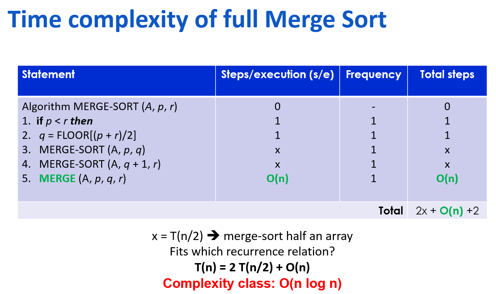

https://chat.deepseek.com/share/kf8yvtio0n04v480qe
---

## 2. 循环不变式（Loop Invariant）

**问题**：写循环时，怎么保证算法是正确的？  
**笔记**：  

- **循环不变式**：每次循环开始或结束时，某个条件一定成立。  
- 作用：① 帮助设计算法 ② 证明算法正确。  
- 例：选择排序中，第 i 次循环结束时，前 i 个数是全局最小的 i 个数且有序。

---

## 3. 选择排序（Selection Sort）

**问题**：如果每次从剩余数里挑最小的放前面，循环不变式是什么？  
**笔记**：  

- **循环不变式**：前 i 个数是全局最小的 i 个数，且已排好序。  
- **步骤**：  
  1. 在未排序部分找最小值  
  2. 交换到已排序部分的末尾（a[i]）  

- **时间复杂度**：始终 O(n²)（比较次数固定 n(n-1)/2，交换 n-1 次）  
- **空间复杂度**：O(1)（原地排序）  
- **特点**：与输入顺序无关，比较次数固定。

---

## 4. 嵌套循环的步数计算

**问题**：选择排序中内层循环一共执行多少次？  
**笔记**：  

- 外层 i=1 到 n-1，内层从 i+1 到 n  
- 执行次数：(n-1) + (n-2) + … + 1 = n(n-1)/2 ≈ n²  
- 这是 O(n²) 的来源。

---

## 5. 插入排序（Insertion Sort）

**问题**：打牌时整理手牌，属于哪种排序思想？  
**笔记**：  

- **思想**：每次把当前元素插入到前面已排序部分的正确位置。  
- **步骤**：  
  1. 从 i=2 开始（第一个元素认为已排序）  
  2. 当前元素向左比较，直到找到合适位置  
  3. 插入（通过交换或平移）  

- **时间复杂度**：  
  - 最好（已有序）：O(n)  
  - 最坏（逆序）：O(n²)  
  - 平均：O(n²)  

- **空间复杂度**：O(1)  
- **特点**：对**几乎有序**的数据很快。

---

## 6. 插入排序的最好/最坏情况

**问题**：什么情况下插入排序最快？最慢？  
**笔记**：  

- **最好**：输入已经有序 → 只比较不交换 → O(n)  
- **最坏**：输入逆序 → 每个元素都要移到最前面 → 比较+交换次数 ≈ n(n-1)/2 → O(n²)  
- **平均**：每个元素大约移动一半位置 → 仍为 O(n²)

---

## 7. 冒泡排序（Bubble Sort）

**问题**：冒泡排序的名字怎么来的？如何优化？  
**笔记**：  

- **思想**：两两比较，大的元素向右“冒泡”。循环不变量：第i次外层循环，从右往左数第i个位置的数确定  
- 每轮结束，最大元素在最后。  
- **优化**：加 `swapped` 变量，如果一轮没有交换，说明已有序，提前退出。  
- **最好情况**：O(n)  
- **最坏/平均**：O(n²)

---
## 8. quick sort and partition algo

+ 已知pivot 在数组中的起始位置和元素值，通过partition algorithm这个算法可以让pivot到达一个特定的位置，这个位置满足：pivot 左边都 ≤ pivot，右边都 ≥ pivot。
+ 为什么partition一定要这么复杂，直接排序随便取一个数都满足左边的数小右边的数大呀，这个到底在解决什么？
+ 本身就是在随便取一个数pivot，这个算法是在对数组进行调整，满足特定关系。当然，quick sort取数的不同会带来复杂度的不同。比如每次都取最中间，就会带来 $O(n \log n)$ 的 best case；每次都依次按顺序取，就会带来 $O(n^2)$ 的 worst case。👉 Merge Sort 从中间分是为了结构简单和递归均衡，而不是为了优化复杂度；

👉 Quick Sort 才是那个“分得好不好直接决定复杂度”的算法

+ Partition 的唯一目标

给定一个 pivot 值（比如选第一个元素），找到它最终应该在数组中的下标，并把数组调整成：左边都 ≤ pivot，右边都 ≥ pivot。
它不是为了排序，只是为了定位一个元素。
复杂度要尽可能低，
原地	不能开新数组
线性	最多扫几遍，不能嵌套循环

+ quick sort跟partition algo有什么关系呢？
  后者为前者提供一个分界点，好让quick sort分堆。

+ 分堆算法，时间$O(n)$,一个while大循环，两个小循环。空间$O(1)$
+ 快排的空间复杂度分析
  best case: $S(n)=S(n/2)+1,\ O(\log n)$
  worst case: $S(n)=S(n-1)+1,\ O(n)$

+ 时间复杂度分析
  $T(n)=T(n/2)+O(n),\ O(nlog n)$;
  $T(n)=T(n-1)+O(n),\ O(n^2)$
## 9. merge sort

时间复杂度：

怎么算的？注意要把$O(n)$当成n来算
空间复杂度：
$O(\log n)+O(n)=O(n)$，因为 $O(n) \gg O(\log n)$
没有最好或最坏。当然如果merge函数没有开辟临时数组，那么空间复杂度就是递归栈深度为$O(\log n)$

## 10. 三种简单排序对比（问题驱动）

| 问题 | 选择排序 | 插入排序 | 冒泡排序 |
| :--- | :--- | :--- | :--- |
| 是否与输入顺序有关？ | 否 | 是 | 是（优化后） |
| 最好时间复杂度 | O(n²) | O(n) | O(n) |
| 最坏时间复杂度 | O(n²) | O(n²) | O(n²) |
| 是否稳定？ | 否 | 是 | 是 |

---

## 最终回顾题（检验是否掌握）

1. 如果数据已经基本有序，选哪种排序？为什么？  
2. 如果数据完全逆序，选选择排序还是插入排序？谁更快？  
3. 为什么选择排序的比较次数永远固定？  
4. 选择与插入的差别是什么？
5. Quick Sort vs Merge Sort:
   1. Which one is stable? 
   2. Which one is typically faster in practice? Why?   


+ 插入
+ ❌ 应该是选择排序更快（虽然两者都是 

O
(
n
2
)
但选择排序的交换次数更少）插入排序：完全逆序时，每个元素都要和前面所有元素比较并移动，比较次数 ≈ 
n
2
/
2
n 
2
 /2，移动次数也 ≈ 
n
2
/
2
n 
2
 /2。选择排序：比较次数固定为 
n(n−1)/2，但交换次数只有 
n−1 次。
在逆序情况下，移动数据（写内存）的成本通常高于比较，所以选择排序更快。

+ 因为选择排序每次要找最小值，必须把未排序部分全部比较一遍，不管数据是否已经有序。
+ 插入循环不变量：外层循环第 i 轮结束时，前 i+1 个元素是已排序的（但不一定是全局最小的）。即：arr[0..i] 是子数组已排序，但后续元素可能更小。而选择排序的是前 i 个是全局最小且已排序。前者元素最终位置	每轮确定一个元素的最终位置，	后者元素不断移动，最终位置最后才确定
+ 1. 归并排序更稳定。先搞清楚稳定的定义: A sorting algorithm is stable if equal elements keep their relative order after sorting. 归并排序的核心在于合并（merge）操作。在合并过程中，如果两个元素的值相等，归并排序会保证先出现的元素仍然在前。那么对于快排，举个例子：
  ```
  {3a, 2, 3b, 1}。
  数组中的两个 3 是不同的元素，分别标记为 3a 和 3b，以便观察它们的相对顺序。
  pivot = a[0] = 3a
  left = 0, right = 3
  i = 1, j = 3
  经过分堆算法，数组变为：{3b, 2, 3a, 1}。相同值的元素（3a 和 3b）的相对顺序发生了改变，某些场景相同值的元素不能混为一谈。如：
  按“成绩”排序后，还要保持“学号顺序”
  多关键字排序（先按A，再按B）
  ```
  2. In-place:在原数组上进行排序，不需要额外的数组存储数据。cache-friendly: 归并排序合并两个子数组时，数据可能分布在不同的内存区域归并排序。而快排分区时主要访问局部数据，符合 CPU 缓存的局部性原理（spatial locality 和 temporal locality）
