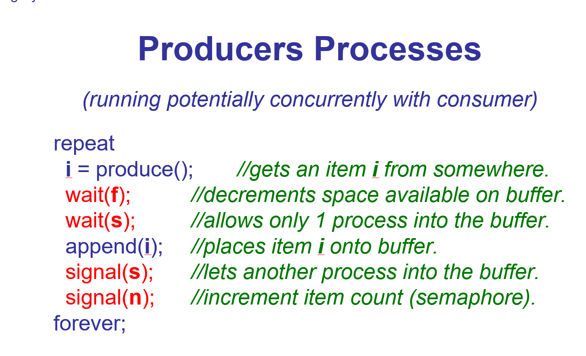

race condition: 多个进程抢占同一个资源。
如何避免：共享某个变量时需要mutex，使得只有critical section code才能运行。
critical section code：A section code that must be executed by one process at one time
mutex：allow one process to 
atomic：不可分割的操作，原子操作是实现信号量的基础。信号量里的 PV 操作（wait 和 signal）必须是原子操作。

特性	互斥量 (Mutex)	信号量 (Semaphore)
所有权	有所有权。只有加锁的线程才能解锁。	无所有权。任何线程都可以执行 signal (V操作)。
初始值	通常初始为 1（解锁状态）。	可以是任意非负整数（0, 1, 2, ...）。
主要用途	保护临界区，实现互斥访问（一次只让一个线程访问共享资源）。	控制对一定数量资源的访问（如连接池、生产者-消费者问题），也用于线程同步。
值范围	只有 0 (锁定) 和 1 (解锁)。	0 到 N (计数信号量) 或 0/1 (二进制信号量，类似Mutex但无所有权)。
操作	lock / unlock （或 acquire / release）	wait (P操作) / signal (V操作)
semapahores信号量：Semaphores allow two or more processes to synchronize their actions coordinate access to a shared resource.保护共享资源通过wait and 
包含count and queue。
count分为binary and general两种。
count = 0，阻塞的是试图执行 wait() 操作的进程，而不是阻塞“所有进程来访问这个代码”。count = 1 表示：有 1 个可用资源，下一个调用 wait() 的进程不会被阻塞，而是会成功获取资源。
queue这个队列通常按先进先出 (FIFO) 顺序（队列）或按优先级排队。内核调度器会从队列中唤醒下一个进程来获取资源。
wait：检查可用资源，如果可用，继续执行；否则等待直到资源可用。
signal：某个进程执行完了，给其他等待资源的进程发送信号表示资源释放了。

wait
critical section code
signal

bounded buffer


## 消费者生产者问题

+ 需要信号量，因为生产者同步进行生产，生产出的资源填充对应buffer的空白区域
+ 需要互斥量，因为buffer是一个整体，一次只能被一个消费者访问拿取资源。
+ n是可用资源数
    f是空闲缓冲区数量，初始值为 size（缓冲区大小）
    s (semaphore)：二进制信号量，初始值为 1。用于保护缓冲区的互斥访问（Mutex），确保同一时间只有一个进程操作缓冲区。

+ 
  为什么以下的顺序不能互换？

```
  wait(f);		//decrements space available on buffer. 
    wait(s);		//allows only 1 process into the buffer. 
  
假设缓冲区已经满了（f = 0），此时一个生产者（Producer）想要运行：
步骤	操作	结果
1	wait(s)	✅ 成功。生产者拿到了互斥锁，进入了临界区。此时其他所有生产者/消费者都被挡在 wait(s) 外面。
2	wait(f)	❌ 阻塞。因为 f = 0，生产者发现没有空闲缓冲区，于是在这个信号量上开始等待。
3	状态	生产者手里攥着互斥锁 s，但蹲在 f 上等待空闲位置。
```

## 管程
https://blog.csdn.net/m0_63006478/article/details/130796059
## 停车问题与哲学家进程问题
https://chat.deepseek.com/share/rk0wh2o63zy5yjrio2


## deadlock

### detect
略

### break

+ kill all the deadlocked processes
+ force all deadlocked processes back to last checkpoints and restart them if they have, not safe but simple

### avoid

+ 死锁的本质是资源不够用，如果哲学家进餐问题5个哲学家有10个叉子，就不会死锁
+ safe state: 只要能找到一种分配资源的顺序使得所有的进程都被满足就叫安全的。这里是考点，给你claim matrix and current state matrix and available vector，要你判断是否安全。这个需要在纸上演算。


## 一、消息传递 vs 管程 对比

| 特性 | 管程 | 消息传递 |
|------|------|----------|
| **本质** | 编程语言/操作系统层面的同步构造 | 进程间通信机制 |
| **共享数据** | 共享内存，数据在管程内部 | 无共享内存，通过消息交换数据 |
| **互斥实现** | 编译器自动保证，同一时刻只有一个进程进入管程 | 需要显式使用 send/receive 原语 |
| **同步方式** | 条件变量（wait/signal） | 消息阻塞/非阻塞发送和接收 |
| **编程复杂度** | 较低，互斥由系统保证 | 较高，需手动管理消息传递逻辑 |
| **适用场景** | 共享内存多线程/多进程系统 | 分布式系统、网络通信、多机环境 |
| **典型例子** | Java 的 synchronized + wait/notify | MPI、Socket、管道 |

**一句话总结**：管程适合**单机共享内存**的同步，消息传递适合**分布式/多机**通信。

---

## 二、死锁的四个必要条件

| 条件 | 英文 | 含义 |
|------|------|------|
| **互斥** | Mutual Exclusion | 资源一次只能分配给一个进程，不能共享 |
| **持有并等待** | Hold and Wait | 进程已持有至少一个资源，同时在等待其他进程持有的资源 |
| **不可剥夺** | No Preemption | 资源只能由持有它的进程主动释放，不能被强行剥夺 |
| **循环等待** | Circular Wait | 存在一组进程 {P0, P1, ..., Pn}，P0 等待 P1 持有的资源，P1 等待 P2，...，Pn 等待 P0 |

**四个条件必须同时满足才会发生死锁**，破坏任意一个即可预防死锁。

---

## 三、你笔记中提到/课件出现的专业词汇英文

| 中文 | 英文 |
|------|------|
| 竞争条件 | Race Condition |
| 互斥 | Mutual Exclusion |
| 临界区 | Critical Section |
| 信号量 | Semaphore |
| 互斥量 | Mutex |
| 原子操作 | Atomic Operation |
| 忙等待 | Busy Waiting |
| 死锁 | Deadlock |
| 饥饿 | Starvation |
| 管程 | Monitor |
| 消息传递 | Message Passing |
| 有界缓冲区 | Bounded Buffer |
| 生产者-消费者问题 | Producer-Consumer Problem |
| 哲学家进餐问题 | Dining Philosophers Problem |
| 银行家算法 | Banker's Algorithm |
| 唤醒 | Signal (V操作) |
| 等待 | Wait (P操作) |


# GUI

+ Message-based GUI。把输入包装成消息，用到消息队列
+ Immediate mode GUI。好处就是快，适合用于游戏。坏处是难以实现，难以理解。只需要把input处理成flag变量值，0或1.
2. 共同要求：
   - 能捕获输入、能绘图
   - 处理逻辑不能太耗时

3. 阻塞原因：
   - 循环计算（Type 1）
   - 单次耗时/I/O等待（Type 2）

4. 三种解法：
   - 嵌入消息循环 → 仅 Type 1
   - 定时器 → 仅 Type 1
   - 多线程 → 两种都行（最通用）

