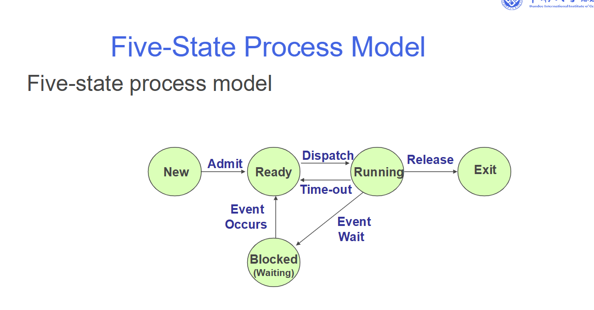
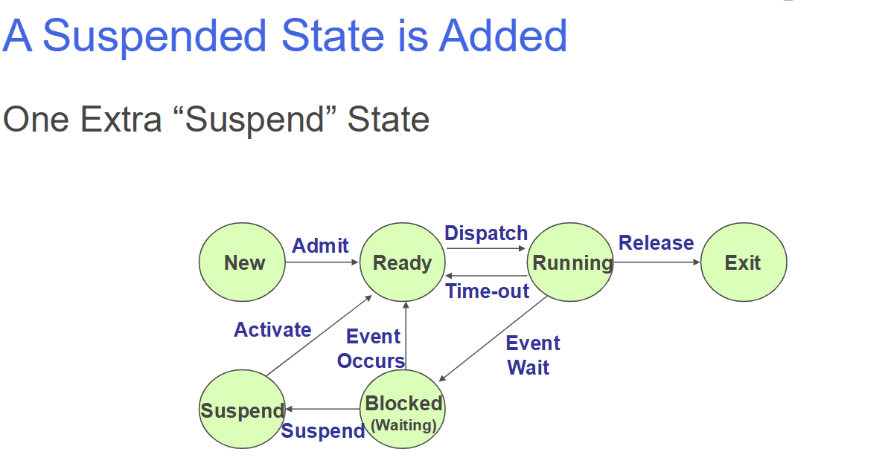

more processor/less memory，如果空间不够，需要用到virtual memory，这就引入了挂起的状态，挂起时用到也就是外存virtual memory
PCB内容：三个板块
process switch：
context：关于计算机状态的信息，包括寄存器内容，执行的进程切换时也会改变。
context switch：

+ 保存当前进程的状态：将当前进程的寄存器、程序计数器（PC）、堆栈指针等硬件上下文保存到该进程的进程控制块（PCB）中。

+ 选择下一个要执行的进程：调度器从就绪队列中选中另一个进程。

+ 恢复新进程的状态：从新进程的 PCB 中读取之前保存的上下文，加载到 CPU 寄存器中。

CPU registers(user and system)
process switch VS context switch

前者比后者慢
## 考点：

+ 画进程的那个图

+ 解释为什么箭头是这样指向。

❌ 没有 Blocked → Running
原因：阻塞态进程不能直接获得 CPU

必须先经过 Ready

❌ 没有 Ready → Blocked
原因：就绪态进程没有在执行，没有机会发起事件等待

❌ 没有 Blocked → Blocked
无意义

❌ 没有 Exit → 任何状态
进程已终止，不可逆

+ 此图需要几个队列？

ready  1

blocked  number of I/O  
场景：进程A在等待打印机，进程B在等待磁盘，进程C在等待网络数据包。

问题：如果它们都挤在一个“大排队区”（单一阻塞队列）。当打印机空闲时，操作系统就必须遍历整个大队列，找到所有等待打印机的进程，才能把它们唤醒。这非常低效。

解决方案：为每种事件或设备设置一个独立的队列。

blocked suspended  number of I/O
blocked-suspended 状态只是 blocked 状态的进程被“暂时赶到外存”，它等待的事件没有变。同上。

ready  suspended  1  
ready-suspended 状态的进程，是在外存（磁盘）上，等待一个整体系统资源：内存。这些进程不关心自己原来是在等打印机还是在等键盘。
